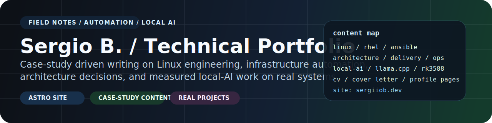

# Technical Portfolio

Case-study driven engineering portfolio built with [Astro](https://astro.build/), published at [sergiiob.dev](https://sergiiob.dev/), and structured to show real delivery work instead of generic blog filler.

[](https://astro.build/)
[](https://pages.github.com/)
[](https://docs.astro.build/en/guides/content-collections/)
[](https://sergiiob.dev/)

## What This Repo Is

This repository is the source for a technical portfolio that focuses on:

- Linux platform engineering
- Ansible and infrastructure automation
- virtualization and enterprise systems work
- local AI, edge inference, and RK3588 experiments
- case-study style writing with situation, issue, solution, and impact framing

The site is intentionally not a generic blog theme with generic posts. It is meant to read like an engineering record: specific problems, implementation choices, and measurable outcomes.

## Stack

- **Astro 5** — static-first rendering with Markdown-native content
- **GitHub Pages** — automated deployment via GitHub Actions
- **Vanilla CSS** — custom dark terminal-inspired theme
- **Content Collections** — typed frontmatter for all posts

## What Makes It Different

- The content is case-study first, not trend-chasing.
- Posts are written around operational problems, not abstract tutorials.
- The same repo holds the site, content model, CV pages, and generated assets.
- The local-AI content is grounded in measured behavior on real hardware rather than summary-table hype.

## Content Areas

- `linux`, `rhel`, and platform operations
- `ansible`, automation, and delivery patterns
- `architecture` and production design tradeoffs
- `local-ai`, `llama.cpp`, and RK3588 benchmarking
- selected project write-ups and implementation notes

## Getting Started

```bash
npm install
npm run dev       # local dev server
npm run build     # production build
npm run preview   # preview the build
npm run generate:og  # regenerate the OG preview image
npm run lint      # run ESLint
npm run lint:fix  # fix linting issues
npm run format    # format code with Prettier
npm run format:check  # check code formatting
```

Open the local preview and review both content and generated assets before publishing. This repo is presentation-sensitive.

## Adding Content

Posts live in `src/content/posts/` as Markdown files with typed frontmatter (see `src/content/config.ts`).

A post template is available at `agent/POST_TEMPLATE.md`.

When adding new posts, the rule is to extend existing topic clusters before creating another near-duplicate article. The RK3588 and local-AI section already has enough surface area that follow-up benchmark methodology is now merged into existing posts instead of spun out into new ones.

## Repository Layout

- `src/` contains the Astro app source.
- `public/` contains static files that are copied to the deployed site as-is.
- `scripts/` contains internal content and asset generation utilities.
- `docs/` contains repository documentation and maintenance notes.

Only files inside `public/` are exposed directly on the final site. Generator scripts, working HTML, and maintenance notes should stay outside `public/`.

## Configuration

Site metadata and profile links are in `src/config/site.ts`.
SEO and page-shell metadata are emitted from `src/layouts/BaseLayout.astro`.
